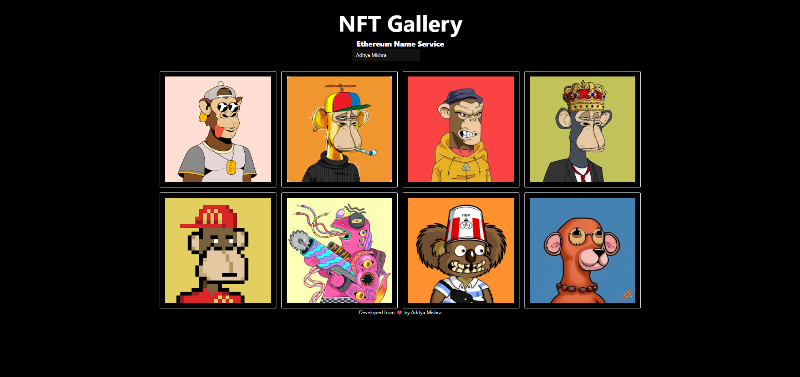

# NFT Gallery

A Next.js powered NFT gallery leveraging QuickNode for seamless NFT data fetching and display, styled with Tailwind CSS for a modern and responsive user interface.



## Project Setup

### Prerequisites

* Node.js and npm (or yarn)
* QuickNode account with an Ethereum node endpoint
* Tailwind CSS installed globally or configured in your project

### Installation
1. Clone the repository:
   ```bash
   git clone https://github.com/mishraji874/NFT-Gallery.git
   ```
2. Navigate to the project directory:
   ```bash
   cd nft-gallery
   ```
3. Install dependencies:
   ```bash
   yarn
   ```

### Environment Setup
1. Create a `.env` file at the root of the project.
2. Add your QuickNode API key and other environment variables:
   ```
   QUICKNODE_NFT_API_KEY=https://your-quicknode-endpoint
   ```

### Running the Development Server
```bash
yarn dev
```

This will start a development server at `http://localhost:3000`.

### Additional Notes
* Consider using environment variables for other sensitive information like wallet addresses or contract addresses.
* Implement error handling and loading states for a better user experience.
* Explore additional features like NFT filtering, sorting, and user authentication.
* Optimize image loading and performance for a smooth user experience.

By following these steps, you can set up and run the NFT gallery project.
